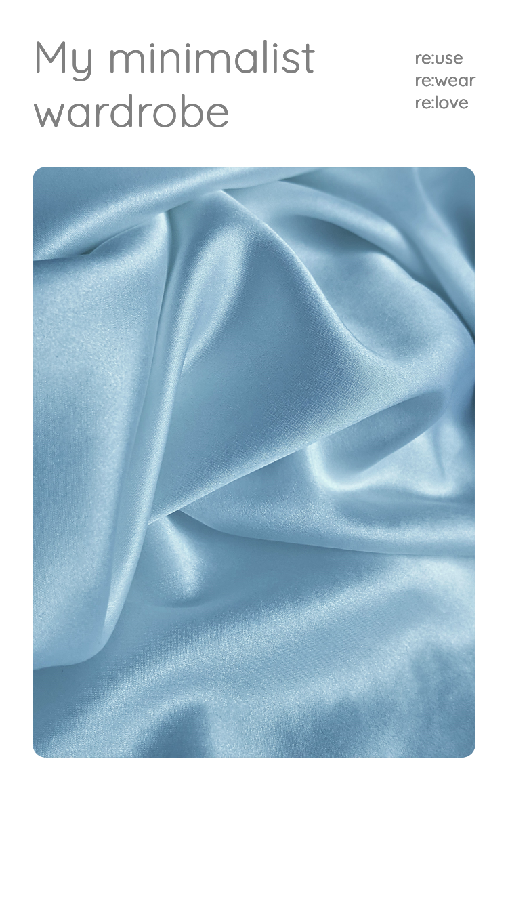

## Re:use. Re:wear. Re:love.

With my minimalist wardrobe app you can finally organize and structure your wardrobe! To avoid wasting money on new clothes, first check your own wardrobe for colors or brands you already have. Of course you can bookmark your favorite garments and maybe get rid off unloved items.

This app was developed as my capstone project during the final four weeks of the neuefische Web Development Bootcamp in July, 2022 in Hamburg/ remote, Germany.

This app was build mobile first, so please switch your browser to responsive mode (iPhone SE).

## App impressions

